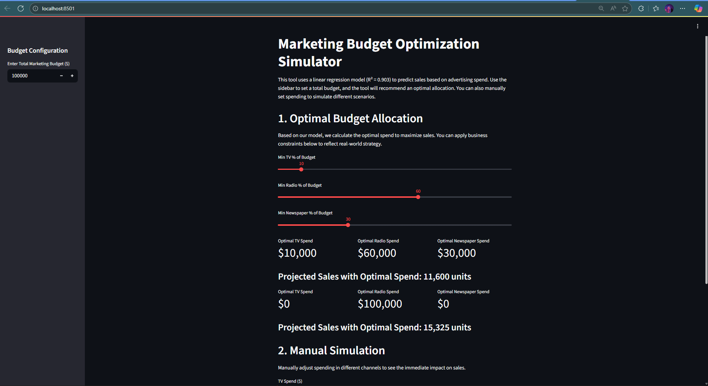

# Marketing Budget Optimization Simulator
An interactive web application built to help businesses make data-driven decisions on marketing budget allocation. This tool moves beyond simple analysis to provide prescriptive, optimized recommendations that maximize sales ROI.
---
**You can access the live, interactive application here:**
**https://marketing-budget-optimizer-eepbgfebazejr7bqxyqenr.streamlit.app**
---
---

## Project Overview
In a competitive market, allocating a marketing budget effectively is a critical challenge. This project addresses this problem by providing a tool that allows a user to:
1.  **Understand** the impact of spending in different channels (TV, Radio, Newspaper).
2.  **Optimize** a given budget for maximum sales, based on a predictive model.
3.  **Simulate** different spending scenarios to make informed strategic decisions.
The application is built on a robust linear regression model with an **R-squared of 0.903**, ensuring that its recommendations are based on statistically significant relationships within the data.
---
## Key Features
*   **Predictive Modeling:** Uses a Scikit-learn regression model to forecast sales based on advertising spend.
*   **Smart Optimization:** Leverages SciPy's optimization engine to find the ideal budget allocation that maximizes predicted sales.
*   **Interactive Scenario Planning:** Users can manually adjust spend in each channel with sliders to see the immediate impact on sales forecasts.
*   **Business Constraint Integration:** The tool was enhanced to allow users to set minimum spending thresholds for each channel, turning a purely mathematical solution into a realistic, strategy-aware recommendation engine.
  
---
## Tech Stack
*   **Language:** Python
*   **Core Libraries:** Pandas, NumPy, Scikit-learn, SciPy
*   **Web Framework & UI:** Streamlit
*   **Visualization:** Matplotlib, Seaborn
*   **Deployment:** Streamlit Community Cloud (via GitHub)
---
## How to Run Locally

To run this application on your local machine, follow these steps:
1.  **Clone the repository:**
    ```bash
    git clone https://github.com/johnny20214/marketing-budget-optimizer.git
    cd marketing-budget-optimizer
    ```
2.  **Create and activate a virtual environment:**
    ```bash
    python -m venv venv
    source venv/bin/activate  # On Windows, use `venv\Scripts\activate`
    ```
3.  **Install the required dependencies:**
    ```bash
    pip install -r requirements.txt
    ```

4.  **Run the Streamlit application:**
    ```bash
    streamlit run app.py
    ```
